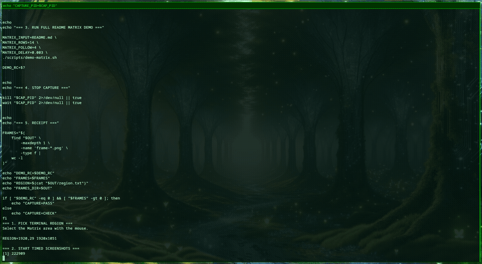

# OCK Rotor

**Reversible byte-rotor experiments for arbitrary files.**

OCK Rotor Free v0.4.0 is an experimental Linux x86_64 CLI that transforms arbitrary byte streams through generated 256-byte rotors and stores the result in an authenticated `OCKR4` container.

> Experimental cryptographic software. Not audited encryption.

## Current release

**OCK Rotor Free v0.4.0 — Linux x86_64 prerelease**

Public artifact:

https://github.com/OKCompressor/core/tree/main/drops/ock-rotor/v0.4.0

Archive:

https://raw.githubusercontent.com/OKCompressor/core/main/drops/ock-rotor/v0.4.0/ock-rotor-v0.4.0-linux-x86_64.tar.gz

SHA-256:

`5bc19226d01ef9ccf1b6b231ed047b0c95174e55f62e70bbd790db0e201c2994`

## What v0.4 does

- arbitrary byte-stream input
- generated 256-byte rotors
- configurable rotor count
- dynamic per-byte rounds
- integer key material
- dictionary / word key material
- file, stdin and literal-text input
- file, stdout and hexadecimal output
- OCKR4 container
- nonce + round + rotor metadata
- 32-byte experimental authentication tag
- tag verification before decode

## Receipts

The v0.4.0 freeze includes:

- multilingual UTF-8 roundtrip
- all-byte fixture roundtrip
- arbitrary PDF roundtrip
- byte-perfect PDF restoration
- identical original/restored SHA-256
- OKPass-derived word-key roundtrip
- valid but incorrect key rejected before restoration

PDF roundtrip receipt:

`c2b3ef5a8d6bc68e667aa01e8405dcfd9ebe88cfe1c6e58f04c5a6d652ce7af9`

## Key material

See:

[`docs/KEY_MATERIAL.md`](docs/KEY_MATERIAL.md)

OCK Rotor Free v0.4 accepts integer sequences/files and dictionary-backed word sequences/files.

A future Pro interface is being explored for secret material that does not need to appear in shell arguments.

## Limits

OCK Rotor is experimental / educational cryptographic software.

It is not audited encryption and should not be treated as established cryptographic protection.

Keep independent backups of important data.

The Rust implementation is not included in this public repository.

## Licensing / source

Human experimentation and research remain the public-facing lane.

Source access, commercial organizational use, integration, technical transfer and support are handled separately by OKCompressor / OKC.

Canonical OKC licensing framework:

https://github.com/OKCompressor/core/blob/main/docs/LICENSE.md

Artifact-specific terms:

[`ARTIFACT_TERMS.md`](ARTIFACT_TERMS.md)

---

**Bring bytes. Get receipts. Restore exactly.**
